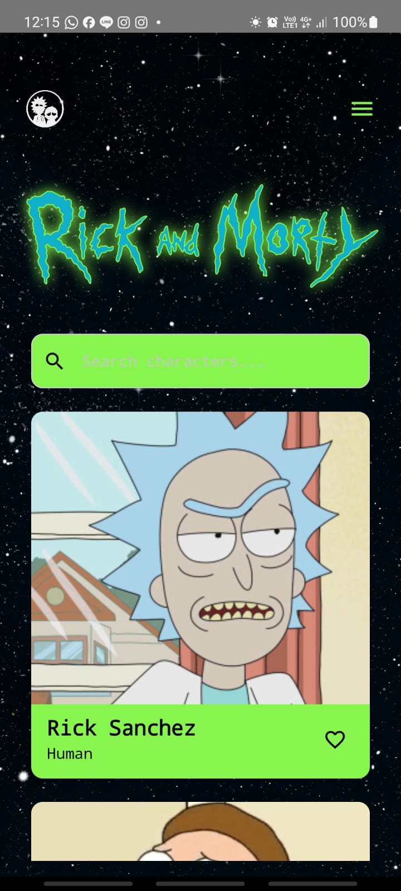
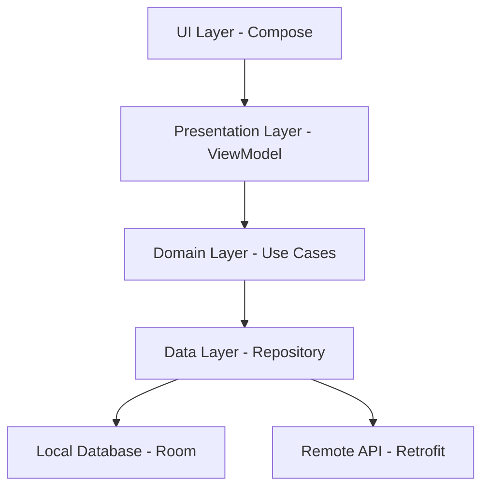

# 🚀 Rick and Morty Character Explorer  
**_Bejana Takehome Test_**

> Jelajahi dunia Rick & Morty dengan pengalaman Android modern, performa optimal, dan UI yang engaging.  

---

## 📘 Overview

**Rick and Morty Character Explorer** adalah aplikasi Android berbasis Kotlin dan Jetpack Compose yang memungkinkan pengguna mencari dan menyimpan karakter favorit dari serial "Rick and Morty". Dengan implementasi Clean Architecture, aplikasi ini ringan, modular, dan scalable.

---

## ✨ Fitur Utama

- 🔍 **Search Characters**  
  Cari karakter berdasarkan nama, dengan auto-complete dan riwayat pencarian (search history via Room).

- ❤️ **Favorite System**  
  Simpan dan kelola daftar karakter favorit secara lokal dengan SQLite + Room.

- 🎨 **Modern UI**  
  Jetpack Compose + Material 3 untuk tampilan yang interaktif dan smooth.

- 💡 **Dynamic Theming**  
  Dukungan untuk tema terang/gelap yang konsisten.

- 📴 **Offline Mode**  
  Dukungan akses offline untuk data favorit dan histori pencarian.

---

## 🧰 Tech Stack

| Layer | Tools / Frameworks |
|-------|---------------------|
| **Language** | Kotlin |
| **UI** | Jetpack Compose, Material Design 3 |
| **Architecture** | MVVM + Clean Architecture |
| **Dependency Injection** | Hilt (Dagger) |
| **Network** | Retrofit |
| **Local DB** | Room |
| **Image Loading** | Coil |
| **Async** | Kotlin Coroutines + StateFlow |


---

## 🏗️ Project Structure

```
app/
├── 📁 components/          # Reusable UI components
├── 📁 config/             # App configuration & constants
├── 📁 controllers/        # Navigation & flow controllers
├── 📁 data/               # Data layer
│   ├── 📁 api/           # Network API interfaces
│   ├── 📁 db/            # Room database entities & DAOs
│   ├── 📁 model/         # Data models & DTOs
│   └── 📁 repository/    # Repository implementations
├── 📁 di/                 # Dependency injection modules
├── 📁 domain/             # Business logic layer
│   └── 📁 repository/    # Repository interfaces
├── 📁 presentation/      # UI layer
│   ├── 📁 common/        # Shared UI components
│   ├── 📁 detail/        # Character detail screen
│   ├── 📁 favorite/      # Favorites screen
│   ├── 📁 home/          # Home screen
│   ├── 📁 main/          # Main container screen
│   └── 📁 search/        # Search functionality
├── 📁 resources/         # App resources (colors, strings, etc.)
├── 📁 routes/            # Navigation routes
├── 📁 services/          # Background services
├── 📁 styles/            # UI themes & styling
└── 📁 utils/             # Utility functions
```

---

## ✨ Features

### 📱 UI & Screens

| Splash | Home | Search | Favorites | Detail |
|--------|------|--------|-----------|--------|
|  |  |  |  |  |

> Semua background menggunakan PNG transparan agar menyatu dengan UI.

### 🔍 Search & Room Integration

- Riwayat pencarian tersimpan otomatis menggunakan Room Database.
- Riwayat tampil saat field search di-*focus*.
- Hasil pencarian ditampilkan real-time menggunakan Flow.
- Riwayat dapat dihapus satuan maupun seluruhnya.

### ❤️ Favorite System
- **Dynamic Favorite Button**: Icon berubah sesuai status favorite
- **Local Storage**: Data tersimpan menggunakan SQLite Room database
- **Favorite Screen**: Halaman khusus untuk menampilkan koleksi favorit
- **Real-time Updates**: Perubahan status favorite langsung terupdate

### 📱 Character Detail
- **Complete Information**: Status, species, gender, origin, location
- **Custom Icons**: Icon khusus untuk setiap informasi
- **Navigation**: Back button dengan smooth transition

---

## 🧪 Testing

Aplikasi ini mencakup comprehensive unit testing dengan coverage tinggi:

### Test Categories
- **Repository Tests**: `FavoriteRepositoryImplTest`
  - Database CRUD operations
  - Favorite status checking
  - Data conversion validation

- **ViewModel Tests**: `HomeViewModelTest`
  - API integration testing
  - Error handling validation
  - State management verification

- **Entity Tests**: `EntityConversionTest`
  - Data model conversions
  - Null safety validation
  - Edge case handling

### Testing Framework
```kotlin
// JUnit 4 + Mockito + Kotlin Coroutines Test
testImplementation("junit:junit:4.13.2")
testImplementation("org.mockito:mockito-core:5.5.0")
testImplementation("org.mockito.kotlin:mockito-kotlin:5.1.0")
testImplementation("org.jetbrains.kotlinx:kotlinx-coroutines-test:1.7.3")
```

---

## APK Download


### 📦 Latest Release
> **Version:** 1.0.0 | **Size:** ~12 MB | **Min SDK:** 24 (Android 7.0)

[]

### 📋 Installation Instructions
1. **Download APK** dari link di atas
2. **Enable Unknown Sources** di Settings > Security (jika diperlukan)
3. **Install APK** dengan tap file yang sudah didownload
4. **Buka aplikasi** dan nikmati Rick & Morty Character Explorer!

---

## �🚀 Installation & Setup

### Prerequisites
- Android Studio Hedgehog | 2023.1.1+
- JDK 11 or higher
- Android SDK 34+
- Gradle 8.0+

### Setup Instructions

1. **Clone Repository**
```bash
git clone https://github.com/Riftisaa/bejanaTest
cd BejanaTest
```

2. **Open in Android Studio**
```bash
# Open project in Android Studio
android-studio .
```

3. **Build Project**
```bash
./gradlew build
```

4. **Run Tests**
```bash
./gradlew test
```

5. **Install on Device**
```bash
./gradlew installDebug
```

---

## 📐 Architecture

### Clean Architecture Implementation



### Key Architectural Patterns
- **MVVM**: Model-View-ViewModel pattern untuk separation of concerns
- **Repository Pattern**: Abstraksi data layer untuk testing dan maintainability
- **Dependency Injection**: Hilt untuk loose coupling dan testability
- **Reactive Programming**: StateFlow/Flow untuk reactive data streams

---

## 🎨 UI/UX Design

### Design System
- **Color Palette**: Green accent (#87F54E) dengan Material Design 3
- **Typography**: Modern font hierarchy dengan IBM Plex Mono
- **Layout**: Responsive design dengan proper spacing dan alignment
- **Animations**: Smooth transitions dan micro-interactions

### Screen Previews

| Home Screen | Search Screen | Favorite Screen | Detail Screen |
|-------------|---------------|-----------------|---------------|
|  |  |  |  |

---

## 🔗 API Integration

### Rick and Morty API
- **Base URL**: `https://rickandmortyapi.com/api/`
- **Endpoints Used**:
  - `GET /character` - Fetch characters list
  - `GET /character/{id}` - Get character details
  - `GET /character/?name={name}` - Search characters

### Network Implementation
```kotlin
// Retrofit interface
interface RickAndMortyApi {
    @GET("character")
    suspend fun getCharacters(
        @Query("page") page: Int? = null,
        @Query("name") name: String? = null
    ): ApiResponse<Character>
    
    @GET("character/{id}")
    suspend fun getCharacter(@Path("id") id: Int): Character
}
```

---

## 📊 Performance Optimizations

- **Lazy Loading**: Efficient memory usage dengan LazyColumn
- **Image Caching**: Coil untuk intelligent image loading dan caching
- **Database Optimization**: Room dengan proper indexing
- **Coroutines**: Non-blocking operations untuk smooth UI
- **State Management**: Efficient state updates dengan StateFlow

---


## 👨‍💻 Developer

**[Riftisaa](https://github.com/Riftisaa)**
- GitHub: [@Riftisaa](https://github.com/Riftisaa)
- Project Repository: [BEJANATEST](https://github.com/Riftisaa/bejanaTest)
- 📱 APK Download: Available via Google Drive (link above)


---


